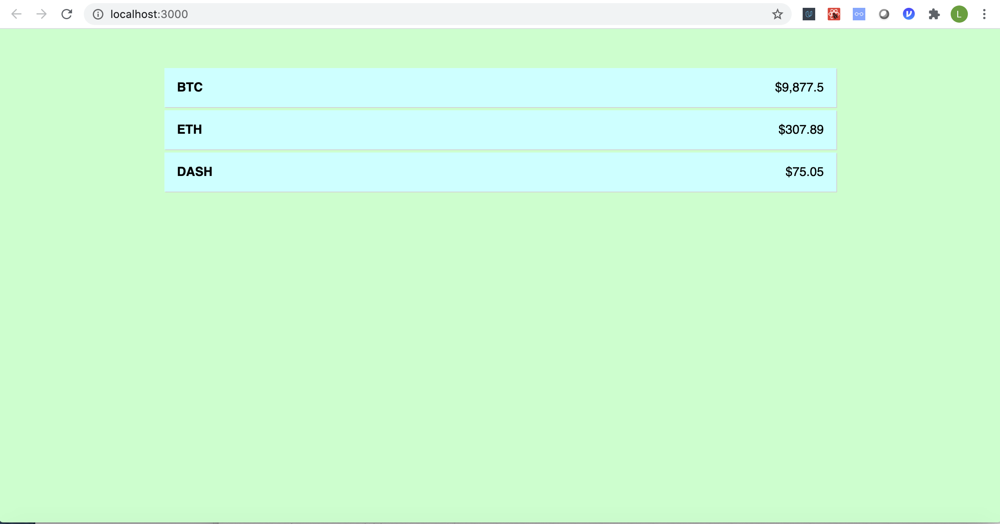

# React Crypto Currency Web App

This shows the current prices of Bitcoin, Ethereum and Iota

This project uses the free [CryptoCompare API](http://cryptocompare.com/api) service. Will be further using this for stock analysis. The web app is served at https://akshayjaitly.github.io/React_Cryptocurrency/

## Screenshot

## Offline first in production 

https://create-react-app.dev/docs/making-a-progressive-web-app/#offline-first-considerations

## Create react app in gh-pages

Thanks to [Gitname]https://github.com/gitname.
This is the link: https://github.com/gitname/react-gh-pages/tree/master

## How to use this

Clone this repo and run `npm install` in the project folder. From there, you can run `npm start` to watch the project in action.

## Production build serve

  > 1. npm run build
  > 2. npm install -g serve
  > 3. serve -s build

